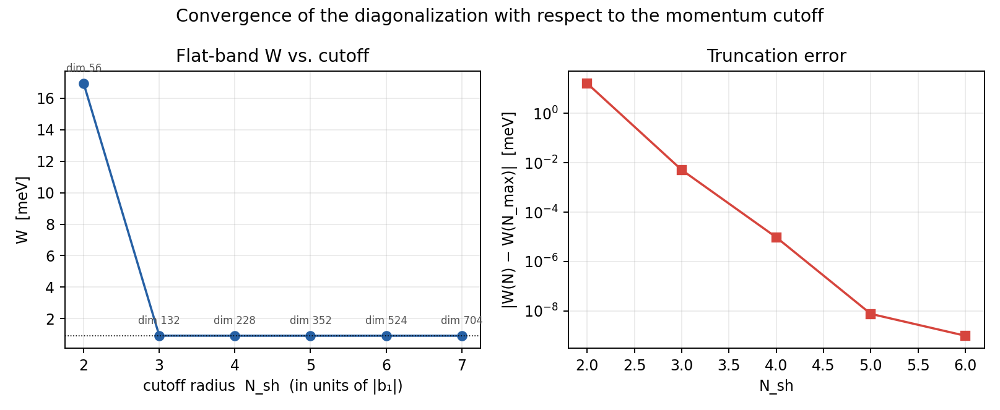
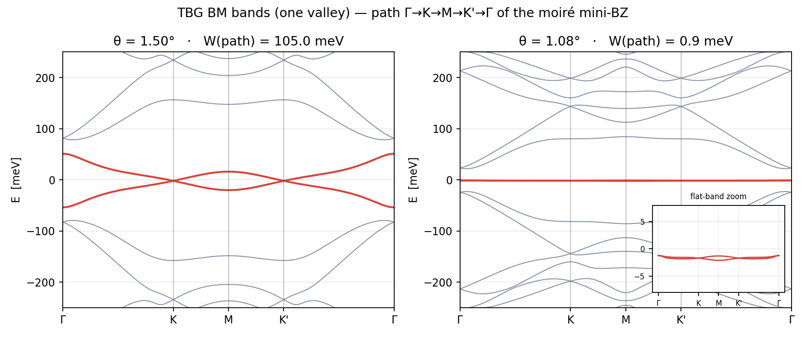
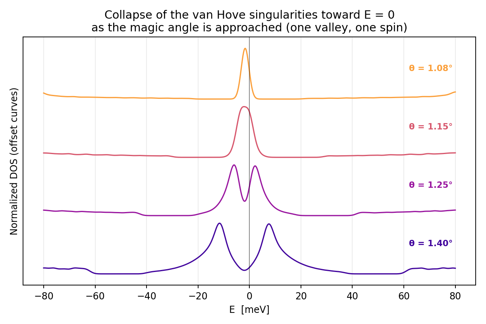
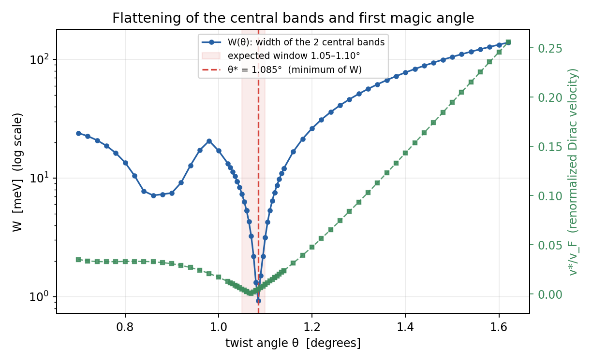

# Twisted bilayer graphene — Bistritzer–MacDonald simulator

This is an interactive simulator for the electronic band structure of twisted
bilayer graphene (TBG), based on the Bistritzer–MacDonald (BM) continuum model.
The web version runs entirely in the browser: drag the twist angle and watch
the central bands flatten as you close in on the first magic angle. No setup,
nothing to install; it's a single HTML file.

**[▶ Try it live](https://R-Carrasco.github.io/tbg-simulator/)**


---

## What you can do with it

The main panel computes the band structure in real time along the
Γ → K → M → K′ → Γ path of the moiré mini-Brillouin-zone, updating as you move θ.
A few things worth playing with:

- **Find the magic angle yourself.** The W(θ) sweep tracks the combined width of
  the two central bands across a range of angles and pins down the minimum θ\*,
  refined parabolically. With the reference parameters it lands at θ\* ≈ 1.085°.
- **Watch the density of states collapse.** Computed over a mini-BZ grid. As you
  approach θ\*, the van Hove singularities merge into a single sharp peak at E ≈ 0.
- **Compare rigid and relaxed tunneling.** Toggle between equal interlayer
  hoppings (w_AA = w_AB = 97.5 meV) and the relaxed lattice
  (w_AA = 79.7 meV < w_AB), where corrugation suppresses AA/BB tunneling and
  opens the gaps that isolate the flat bands.
- **See the moiré pattern itself.** The bottom strip draws the two honeycomb
  layers rotated by ±θ/2 to scale, with the real moiré period
  λ = a / (2·sin(θ/2)), so the supercell visibly grows as θ shrinks. In the
  relaxed regime a first-harmonic displacement field is applied on top, so the
  AA regions contract and the triangular AB/BA domains grow (just like in reality).

## The physics, briefly

Single valley (K), single spin. The two layers carry Dirac cones rotated by
∓θ/2, coupled by interlayer tunneling

```
T_j = w_AA·σ0 + w_AB·[cos(jφ)·σx + sin(jφ)·σy],   φ = 2π/3
```

with ħv_F = 2.1354·a and a = 0.246 nm. The Hamiltonian is assembled in a
plane-wave basis with a circular momentum cutoff of radius N_sh·|b₁|, where b₁
is one of the two moiré reciprocal-lattice vectors — it sets the spacing of the
plane-wave grid, so N_sh ("number of shells") is just how far out from the
centre that grid extends. You can pick N_sh = 2, 3, or 4; higher keeps more
plane waves, which is more accurate but slower, and only really matters at the
smallest angles.



Finding the energy bands means finding the eigenvalues of the Hamiltonian
matrix H. Because its entries are complex numbers, H is Hermitian, which 
guarantees the eigenvalues (the energies) come out real. Rather than handle 
complex arithmetic directly, the code rewrites H = A + iB as a larger, purely 
real symmetric matrix [[A, −B], [B, A]] that has exactly the same eigenvalues, 
each appearing twice. That real matrix is then diagonalised in two standard, 
well-tested steps: a Householder reduction that squeezes it into a simpler 
tridiagonal form, then the implicit-QL algorithm that reads the eigenvalues 
off it. The result is a fast, robust solver that needs no external libraries 
and runs comfortably in the browser.





## How much to trust it

Two checks I cared about:

- The eigensolver agrees with SciPy to within < 10⁻¹⁴ eV.
- With the relaxed parameters, the W(θ) minimum sits at θ\* ≈ 1.085°, comfortably
  inside the expected 1.05°–1.10° window.



That said, it's a continuum BM model and should be read as one. It captures the
flat-band physics around the first magic angle, but there's no lattice-scale
detail, no fully self-consistent relaxation, and no electron–electron
interactions. The relaxation in the moiré strip is a qualitative first-harmonic
picture for intuition, not a relaxed-Hamiltonian calculation.

## Running it

The web app needs nothing — open `index.html` in a browser, or serve the
folder if you prefer a local server:

```bash
python3 -m http.server 8000
# then open http://localhost:8000/index.html
```

On GitHub Pages the file is served as `index.html` at the repo root.

The reference Python script is the canonical version the web solver was checked
against; run it if you want the ground-truth numbers or a starting point for
your own modifications. It also writes out the four figures
(`fig1_bands.png` … `fig4_convergence.png`) into the folder you run it from.

## A note on how it was built

I built this with the help of Anthropic's **Claude Fable 5**.
What I found interesting was where the time actually went: not
into hand-writing the eigensolver or the moiré geometry, but into pinning down
the physics precisely and then verifying the output — the magic-angle location,
the agreement with SciPy, the DOS behaviour near θ\*. The assumptions and their
limits are spelled out above rather than buried, which felt like the honest way
to ship something like this.

## License

Released under the MIT License — see [LICENSE](LICENSE). Use it, fork it, build
on it; a credit back is appreciated but not required.
